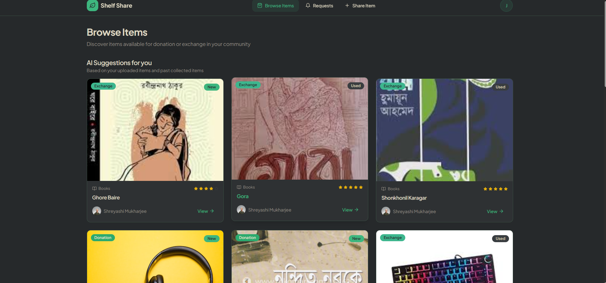
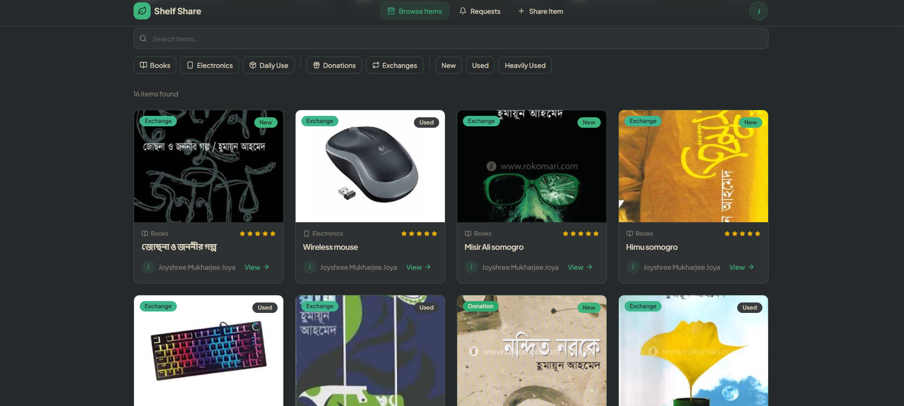
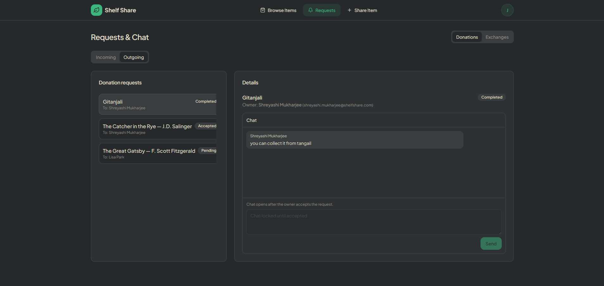
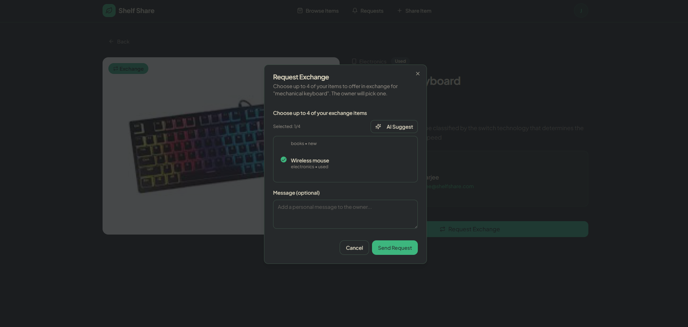

# 📚 Shelf Share — Community Donation & Exchange Platform

Shelf Share is a full-stack web application where users can **donate** or **exchange** items (especially books) in a structured, fair way.  
Instead of items disappearing instantly after someone clicks “claim”, Shelf Share uses a **Request → Accept/Deny → Chat → Complete** workflow to ensure real communication and proper handover.

---

## 🎥 Demo
> Add your demo video link here (optional)  
Demo: https://your-demo-link

---

## ✨ Key Features

### ✅ Authentication & User System
- Register/Login using **JWT authentication**
- Passwords secured using **bcrypt hashing**
- Profile view (name, email, badges/points)

### 📦 Item Management
- Upload items with title, description, tags, category, condition, and images
- Items are stored in **MongoDB** (persistent database)
- Item owner info includes:
  - **Owner name**
  - **Owner email** (for better communication)

### 🎁 Donation Workflow (Fair Claim System)
Donation items follow a structured flow:

1. User clicks **Request Donation**
2. Item goes **ON HOLD** (still visible on website)
3. Owner receives request in **Requests Center**
4. Owner can **Accept** or **Deny**
5. If accepted → **Chat opens** between both users
6. Owner clicks **Mark as Completed** after successful handover
7. Then item becomes **TAKEN** and disappears from listings

✅ Prevents “instant claim and disappear” issue.

### 🔁 Exchange Workflow (Offer 4 Items + Owner Chooses 1)
Exchange works like donation, but includes a smart offer system:

1. Requester clicks **Request Exchange**
2. Requester selects up to **4 of their own items** as offers
3. Item goes **ON HOLD**
4. Owner sees request and chooses **1 offer** from the 4
5. Owner **Accepts/Deny**
6. If accepted → **Chat opens**
7. Owner clicks **Mark as Completed**
8. Both items become **TAKEN** and disappear from listings

### 💬 Communication System (Chat)
- Built-in chat for donation & exchange requests
- Messages stored in MongoDB
- Request status tracking: pending / accepted / denied / completed

### 🔔 Request Notifications
- Navbar shows a **pending request count**
- Requests page organizes incoming/outgoing requests

### 🖼️ Real Book Covers (Exact Covers)
- Books automatically load **real cover images** using **Open Library API**
- Fallback to placeholder if a cover isn’t available

### 🤖 AI Suggestions (Extra Marks Feature)
- AI-style suggestions based on:
  - your uploaded items
  - your past collected items
  - similarity of tags/category/title
- Helps recommend:
  - “Items you may like”
  - best offer items during exchange request (optional feature)

---

## 🧰 Tech Stack

### Frontend
- **React + TypeScript**
- **Vite**
- **Tailwind CSS**
- **shadcn/ui + Radix UI**
- **React Router DOM**

### Backend
- **Node.js + Express**
- **MongoDB**
- **Mongoose**

### Security
- **JWT (jsonwebtoken)**
- **bcrypt**

### APIs / Integrations
- **Open Library Covers API** (for real book cover photos)

---

## 🖼️ Screenshots (Add yours here)

> Create a folder like `assets/screenshots/` and add images, then link them.

### 🏠 Landing Page


### 📊 First page


### 📄 Item Details


### 📩 Requests & Chat


### 🔁 Exchange Offer Selection


---

## ⚙️ Run the Project Locally

### ✅ Prerequisites
- **Node.js** installed (LTS recommended)
- **MongoDB** installed and running locally (or use MongoDB Atlas)
- **npm** (comes with Node)

---

## 🔐 Environment Setup

Create a `.env` file in the project root:

```env
MONGODB_URI=mongodb://127.0.0.1:27017/shelfshare
PORT=5000
JWT_SECRET=your_secret_key_here
ALLOW_AUTO_CREATE=true
